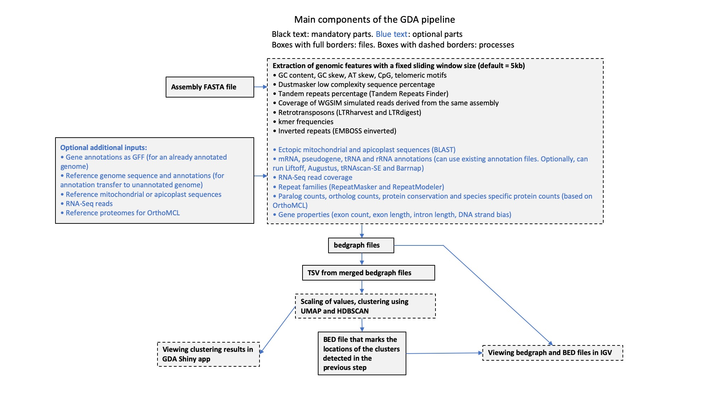

# GDA

Genome Decomposition Analysis for the characterisation of genome architecture

### What is GDA?

GDA (Genome Decomposition Analysis) is a bioinformatic pipeline to analyse genome architecture. Using, as a minimum, a genome assembly (the more complete the better), it will determine features in non-overlapping windows across the sequence and identify windows with common features. The assembly will then be annotated based on these similarities, highlighting structurally similar genomic regions.

GDA is developed by Eerik Aunin (ea10@sanger.ac.uk) and Adam Reid (ar11@sanger.ac.uk)

Below is a diagram of the components of the pipeline.


### Requirements

GDA software consists of three main parts: a genomic feature extraction pipeline, clustering scripts, and a Shiny app for viewing the results. The genomic feature extraction pipeline and the clustering scripts have been tested on a Linux server (Sanger farm) and have the following requirements:

  * Conda
  * Nextflow
  * Python3 
  * Java – with enough memory to initialise the Java virtual machine (on the Sanger farm, Java needs to be run on a compute node because the login nodes do not have enough available memory)
  * Git

The Shiny app for viewing clustering results requires R and a number of R libraries. It has been tested on MacOS and Kubuntu Linux.

### Notes

This GitLab repository has two branches (`master` and `develop`). The `master` branch is frozen in time at around June 2021 (with only some bug fixes applied later), in order to have a fixed version of the pipeline for running analysis for the GDA manuscript. The `develop` branch has ongoing development. 

We expect that the GDA feature extraction and analysis pipeline is run remotely (e.g. via Sanger farm5-login). Viewing the results of a GDA analysis is done in a Shiny app that runs in a web browser and thus we recommend that you copy your results onto your local machine to run the final step. Thus, some dependencies are required remotely and some locally (installation instructions below).

The quick start tutorial will show you how to run the GDA pipeline end-to-end with test data (Plasmodium falciparum genome assembly) and default parameters. In reality you will likely want to add additional, optional tracks such as gene annotations, repeat finding, transcriptome data and orthology information (these are also detailed below).

## Tutorial

### Contents
  * [Quick start with test data](#quick-start-with-test-data)
  * [Understanding the results tabs](#understanding-the-results-tabs)
  * [View clusters and significant tracks in IGV](#view-clusters-and-significant-tracks-in-igv)
  * [Understanding the output files](#understanding-the-output-files)
  * [Adding optional features](#adding-optional-feature)
  * [Optimising clustering](#optimising-clustering)
  * [Understanding the default features](#understanding-the-default-features)
  * [Other output](#other-output)
  * [Using GDA Singularity image](#using-gda-singularity-image)
  * [Troubleshooting](#troubleshooting)
  * [Ideas for analysis](#ideas-for-analysis)

### Quick start with test data

**1. Set up a GDA conda environment on the farm (need to install conda? – https://docs.conda.io/en/latest/miniconda.html)**

  * Clone the GitLab repository (you may need a password for this - try your normal Sanger details)

`git clone https://gitlab.internal.sanger.ac.uk/ar11/gda.git`

  * Run the conda installation script

`python gda/create_gda_conda_env.py gda_env gda_downloads gda`

  * Initiate the conda environment:

`conda activate gda_env`

If the conda installation does not work for you, you can try using the GDA singularity image instead, see [Using GDA Singularity image](#using-gda-singularity-image)

**2. Run GDA**

  * Run GDA’s feature extraction pipeline with test data (must be bsubbed on Sanger farm for Nextflow to work; expect it to take ~15 minutes with the test data):

`bsub -n12 -R"span[hosts=1]" -M10000 -R 'select[mem>10000] rusage[mem=10000]' -o gda_test.o -e gda_test.e "gda extract_genomic_features --threads 12 --pipeline_run_folder gda_pipeline_run gda/test_data/PlasmoDB-49_Pfalciparum3D7_Genome.fasta"`

&nbsp;&nbsp;&nbsp;&nbsp;&nbsp;&nbsp;The results will be in the folder: `gda_pipeline_run`. The output file required for clustering is:

`gda_pipeline_run/merged_bedgraph_table/PlasmoDB-49_Pfalciparum3D7_Genome_merged_bedgraph.tsv`

  * Cluster genome windows and analyse clusters (this should take ~1 minute; n.b. optimised clustering parameters are provided here)

`bsub -n1 -R"span[hosts=1]" -M10000 -R 'select[mem>10000] rusage[mem=10000]' -o gda_clustering_test.o -e gda_clustering_test.e "gda clustering -c 100 -n 5 gda_pipeline_run/merged_bedgraph_table/PlasmoDB-49_Pfalciparum3D7_Genome_merged_bedgraph.tsv"`

&nbsp;&nbsp;&nbsp;&nbsp;&nbsp;&nbsp;The clustering output will be in a folder called: `gda_out`

**3. Install dependencies on your local machine**

MOVE TO YOUR LOCAL MACHINE (e.g. Sanger laptop)

  * Set up environment

&nbsp;&nbsp;&nbsp;&nbsp;&nbsp;&nbsp; First clone the GDA Git repository to your local machine:
`git clone https://gitlab.internal.sanger.ac.uk/ar11/gda.git`

&nbsp;&nbsp;&nbsp;&nbsp;&nbsp;&nbsp;These are the required R libraries:

&nbsp;&nbsp;&nbsp;&nbsp;&nbsp;&nbsp;shiny, ggplot2, devtools, svglite, gplots, rjson, reshape2, gridExtra, scales

&nbsp;&nbsp;&nbsp;&nbsp;&nbsp;&nbsp;If you have an R installation on your local machine that is not conda-based, the following R script should install the required libraries:

&nbsp;&nbsp;&nbsp;&nbsp;&nbsp;&nbsp;`gda/gda_shiny/install_gda_shiny_dependencies_without_conda.R`

&nbsp;&nbsp;&nbsp;&nbsp;&nbsp;&nbsp;Alternatively, the following commands can be used to install a custom conda R environment for the GDA Shiny app:
```
# update conda to v4.10.1
conda update -n base conda

conda create -n gda_env_local r-essentials r-base

conda activate gda_env_local

conda install --yes -c r -c conda-forge r-shiny=1.5.0 r-ggplot2=3.2.1 r-gplots=3.0.3 r-rjson=0.2.20 r-reshape2=1.4.3 r-gridextra=2.3 r-scales=1.0.0 r-svglite=1.2.3

```

  * Copy the data to your local machine e.g.
`scp -r farm5-login:<path>/gda_out/ .`

&nbsp;&nbsp;&nbsp;&nbsp;&nbsp;&nbsp;In order to use scp to copy the files, you have to be connected to the Sanger VPN.

**4. View results**

The required argument for the gda_shiny.py script is a path to a gda_out folder (that comes from the output of gda_clustering.py and which you just copied from the farm). 

```
python3 ../../gda/gda_shiny/gda_shiny.py gda_out
```

### Understanding the results tabs

**UMAP plot**

This shows you how well the clustering worked.  Each point in the plot represents a genomic window. Windows are coloured by cluster. Cluster -1 (grey) is used for unclustered windows. Based on the nature of the genome, the features used, the window size and other parameters, there may, for example, be several very distinct, tight clusters, or perhaps a single diffuse cloud of points. Distinct, tight clusters suggest that GDA has identified regions of the genome which are clearly similar to each other and distinct from other regions. A single diffuse cloud means that there were not strong similarities or differences between subsets of the windows. There might be a lot of the genome which is unclassified (grey) or it might all be included in clusters.Sliders can be used to adjust plots for better viewing and png or svg images can be saved.

**Cluster locations**

Each chromosome/scaffold/contig is shown, with each window coloured based on the clustering. Therefore, this shows how the clusters pattern the chromosomes and, for example, whether a particular cluster tends to be found at the end of chromosomes. Do all chromosomes have a similar pattern? Do sex chromosomes, B chromosomes etc. look distinct from the autosomes?

**Cluster heatmaps**

GDA determines features which have high or low values for windows in a particular cluster compared to other clusters. The heatmap in this tab shows the relative values across clusters for each significantly variable feature. Green means a feature has a relatively high value in a particular cluster, red a relatively low value. You can find the exact values and which were significantly different in the “Feature tables” tab. Adjusting the plot height and the label size can be particularly useful in this tab so that the heatmap is legible.

**Feature tables**

This tab has a table for each cluster (and unclustered windows), describing which features have significantly higher or lower values (by the Kolmogorov-Smirnov test). The default p-value cutoff for the Kolmogorov-Smirnov test is 1e-20.

**Cluster positions across chromosomes**

This tab shows where each cluster tends to occur across the sequences. It helps you to see whether a cluster tends to occur at the ends or in the middles of chromosomes for instance.

**Chromosome cluster composition**

This tab contains a heatmap which clusters chromosomes by their cluster composition. Chromosomes which have similar proportions of each cluster will be closer together in the heatmap. This helps in identifying outliers which might represent interesting sequences such as sex chromosomes, B chromosomes etc.

### View clusters and significant tracks in IGV

**1. Install IGV**

https://software.broadinstitute.org/software/igv/download

**2. Get bedgraph files from farm**

`scp -r farm5-login:<path>/bedgraph_output/ .`

**3. Copy across clustering results (if you haven’t already)**

`scp -r farm5-login:<path>/gda_out/ .`

**4. Make IGV session file**

```
gda/gda_make_igv_session_file.py -g gda/test_data/PlasmoDB-49_Pfalciparum3D7.gff gda_out/cluster_heatmap.csv gda_out/PlasmoDB-49_Pfalciparum3D7_Genome/clusters.bed gda/test_data/PlasmoDB-49_Pfalciparum3D7_Genome.fasta bedgraph_output/
```

**5. Load session file into IGV**

File →“Open Session”

### Understanding the output files

**Bedgraph files**

With your results directory (<YYYYMMDD>_gda_pipeline_run by default; use gda extract_genomic_features --pipeline_run_folder to change), the folder bedgraph_output contains each bedgraph track produced by GDA. These can be loaded into a genome browser (e.g. IGV) for viewing and better understanding why GDA has clustered the genome as it has. We provide the script gda_make_igv_session_file.py to generate an IGV session file for your genome which will show the clusters and tracks for features which are significantly enriched in the clusters.

One of the files generated by the gda_clustering.py script is called 'clusters.bed'. This file marks the locations of each UMAP+HDBSCAN cluster and can be loaded to IGV alongside the bedgraph tracks. The cluster numbers and the colour key are the same as in the UMAP plot of the Shiny app.

**The feature table**

| cluster | feature | cluster_data.size | other_data.size | stat_less | pvalue_less | stat_great | pvalue_great | cluster_median | other_median | cluster_mean | other_mean |
| --- | --- | --- | --- | --- | --- | --- | --- | --- | --- | --- | --- |
| 0 | cpg_percentage | 185 | 4491 | 0.00 | 1.00e+00 | 0.47 | 1.86e-35 | 0.98000 | 0.66000 | 1.15760 | 0.69856 |
| 0 | tandem_repeats_fraction | 185 | 4491 | 0.56 | 1.36e-49 | 0.01 | 9.86e-01 | 0.07840 | 0.15620 | 0.08711 | 0.15905 |
| 0 | wgsim_depth_minimap2 | 185 | 4491 | 0.90 | 4.03e-127 | 0.00 | 1.00e+00 | 3.71320 | 9.94240 | 3.98305 | 9.90542 |
| 1 | cpg_percentage | 4491 | 185 | 0.47 | 1.86e-35 | 0.00 | 1.00e+00 | 0.66000 | 0.98000 | 0.69856 | 1.15760 |
| 1 | tandem_repeats_fraction | 4491 | 185 | 0.01 | 9.86e-01 | 0.56 | 1.36e-49 | 0.15620 | 0.07840 | 0.15905 | 0.08711 |
| 1 | wgsim_depth_minimap2 | 4491 | 185 | 0.00 | 1.00e+00 | 0.90 | 4.03e-127 | 9.94240 | 3.71320 | 9.90542 | 3.98305 |


### Adding optional features

We recommend you add as many features as possible so that the clustering is able to identify those which are the strongest signals in the genome.

#### Optional features which do not require additional data

**1. Run repeat finding to get bedgraph tracks of individual complex repeat features as well as complex_repeat_sum (the sum of all these features)**
The GDA pipeline contains two mandatory components for repeat detection: TandemRepeatsFinder for tandem repeats and EMBOSS einverted for inverted repeats. Besides these, the GDA pipeline has two optional repeat family detection modules from which the user can choose one to run. The first one of these modules uses RepeatModeler+RepeatMasker and the second one uses Red+MeShClust2.RepeatModeler+RepeatMasker is relatively slow and may take ~1 week to run for large genomes (11 hours for the test dataset). This will require using the basement queue on farm5. The Red+Meshclust2 module is much faster, but may produce more noisy repeat families, depending on the genome.
When the GDA pipeline is run with repeat family detection enabled, the bedgraph files of each complex repeat family appear in the complex_repeats subdirectory of the bedgraph_output directory. If RepeatModeler is used, a simple_repeats directory that contains bedgraph files of simple repeat families is also produced. 
In addition, a bedgraph file of the sum of complex repeat families (and if using RepeatModeler, of simple repeat families) is produced. The individual bedgraph tracks of each repeat family are not used as the input for UMAP clustering by default, but the tracks for the sums of simple or complex repeat families are used.

```
--run_repeat_family_detection
--repeat_family_detection_engine <repeatmodeler/meshclust2>
```

e.g.
```
bsub -n12 -R"span[hosts=1]" -M10000 -R 'select[mem>10000] rusage[mem=10000]' -o gda_repeatmodeler_test.o -e gda_repeatmodeler_test.e "gda extract_genomic_features --threads 12 --run_repeat_family_detection --repeat_family_detection_engine repeatmodeler gda/test_data/PlasmoDB-49_Pfalciparum3D7_Genome.fasta"
```

**2. De novo gene annotation**
The GDA pipeline can take an existing gene annotations GFF3 file as input. For the cases where there is no existing gene annotations available for the genome, the pipeline contains an optional module that produces a de novo annotation of protein coding genes, rRNA and tRNA genes (using Augustus, Barrnap and tRNAscan-SE). The gene annotation module can optionally take an annotated related genome as the input and produce hints for Augustus based on annotation transfer with Liftoff.Several bedgraph feature tracks are derived from gene annotations:mRNA_annotation, exon_count, gene_average_exon_length, gene_average_intron_length, gene_length, tRNA_annotations, rRNA_annotations. Optionally, a gene_dna_strand_bias track is also produced. 
Also, a GFF file of the annotations can be found in the ‘gene_annotation’ folder. The GFF file also includes the tRNAscan and Barrnap results.

Multiple options are required
```
--run_gene_annotation_pipeline
--annotation_target_species_id <label_for_gene_ids>
--augustus_species <pick_from_list>
```

e.g.

```
bsub -n12 -R"span[hosts=1]" -M10000 -R 'select[mem>10000] rusage[mem=10000]' -o gda_test_aug.o -e gda_test_aug.e "gda extract_genomic_features --threads 12 --pipeline_run_folder aug_test_runfolder --run_gene_annotation_pipeline --annotation_target_species_id PFALTEST --augustus_species pfalciparum gda/test_data/PlasmoDB-49_Pfalciparum3D7_Genome.fasta"

```

#### Optional features requiring additional data

**1. Genome annotation**
`--gff_path <GFF3 file with existing gene annotations>`

For handling user-provided GFF files, the pipeline expects the following things:
  *the input file is in GFF3 format (GTF or GFF2 are not accepted)
  *the tags for mRNA, pseudogene, tRNA and rRNA features are "mRNA", "pseudogene", "tRNA" and "rRNA". The user should check the GFF file to make sure that the tags are named according to this convention. If, for instance, the mRNA features in the GFF file are called "transcript" instead of "mRNA", the pipeline does not recognise them as the mRNA features.
  *the GFF file should pass the GenomeTools GFF3 validator check (http://genometools.org/cgi-bin/gff3validator.cgi).

The user can specify non-standard GFF3 feature tags from the input GFF3 file to be turned into bedgraph tracks using the --custom_gff_tags option of the gda wrapper. For example, if the input GFF3 file has features named "H3K9me3" and "H3K9ac", it is possible to make bedgraph files out of them by specifying them as comma separated custom_gff_tags options:

`
--custom_gff_tags H3K9me3,H3K9ac
`


**2. Reference genome annotation (annotate your assembly using a reference annotation: hints for Augustus are derived from annotation transfer using Liftoff)**

`--reference_assembly_path <reference assembly FASTA file>
--reference_gff_path <reference assembly GFF3 file>
`


**3. RNA-Seq coverage**
RNA-Seq coverage is determined using the mapping of reads to the assembly with HISAT2. The input is a pair of gzipped FASTQ reads.
```
--rna_seq_fastq_1_path
--rna_seq_fastq_2_path
```

e.g. 

```
wget ftp://ftp.sra.ebi.ac.uk/vol1/fastq/ERR223/008/ERR2234508/ERR2234508_1.fastq.gz .
wget ftp://ftp.sra.ebi.ac.uk/vol1/fastq/ERR223/008/ERR2234508/ERR2234508_2.fastq.gz .

bsub -n12 -R"span[hosts=1]" -M10000 -R 'select[mem>10000] rusage[mem=10000]' -o gda_test.o -e gda_test.e "gda extract_genomic_features --threads 12 --rna_seq_fastq_1_path ERR2234508_1.fastq.gz --rna_seq_fastq_2_path ERR2234508_2.fastq.gz gda/test_data/PlasmoDB-49_Pfalciparum3D7_Genome.fasta"
```

The resulting feature track is called ‘hisat2_samtools_depth’ and the raw mapping data is in the ‘rna_seq_mapping’ folder.

**4. Gene conservation (orthology)**

`--orthomcl_references_folder`

This folder should contain subfolders, each for separate OrthoMCL runs, e.g. for closely related and more distantly related species (although a single folder is perfectly fine). The folder name is arbitrary. Within each folder there should be protein fasta files for each reference proteome and a file called table_for_gg_file.csv with the names of these files and a simple name for the species. GG files (genome gene relation file) are used by OrthoMCL to relate genes to genomes. e.g.

```
Pchabaudi,PlasmoDB-49_Pchabaudichabaudi_AnnotatedProteins.fasta
Tgondii,ToxoDB-51_TgondiiME49_AnnotatedProteins.fasta
```

Proteins from the genome under consideration will be added behind the scenes (they are derived from the assembly FASTA file and annotations GFF3 file using gffread). N.b. you need to provide annotation for your genome assembly or have it transferred/predicted in order to do the orthology analysis. 

e.g.

```

bsub -n12 -R"span[hosts=1]" -M10000 -R 'select[mem>10000] rusage[mem=10000]' -o gda_test_orthomcl.o -e gda_test_orthomcl.e "gda extract_genomic_features --threads 12 --pipeline_run_folder orthomcl_test_runfolder --orthomcl_references_folder gda/test_data/orthomcl_refs/ --run_gene_annotation_pipeline --annotation_target_species_id PFALTEST --augustus_species pfalciparum gda/test_data/PlasmoDB-49_Pfalciparum3D7_Genome.fasta"
```

The resulting bedgraph files are:

PFALTEST_apicomplexa_ortholog_count.bedgraph - Number of orthologues per gene       

PFALTEST_apicomplexa_paralog_count.bedgraph - Number of paralogues per gene

PFALTEST_apicomplexa_protein_conservation_ratio.bedgraph - The average proportion of species in the OrthoMCL run that have orthologs for the target species proteins in the window. The value is 1 if all target species proteins in the window have OrthoMCL orthologs in all other species in the OrthoMCL run. The value is 0 if none of the target species proteins in the window have any OrthoMCL orthologs in any other species in the OrthoMCL run. 

           
PFALTEST_apicomplexa_species_specific_proteins_ratio.bedgraph - The average proportion of species-specific proteins in the window. It is the number of target species proteins with no OrthoMCL orthologs in the window divided by the number of all target species proteins in the window. The value is 1 if none of the target species proteins in the window have OrthoMCL orthologs, and 0 if all of the target species proteins in the window have OrthoMCL orthologs.

**5. Reference mitochondrial sequence for Nuclear Mitochondrial DNA (NUMT) identification**
NUMT identification is done using BLAST of the genome against a user-provided reference mitochondrial sequence. The reference mitochondrial sequence can be a known mitochondrial sequence from the same species as the rest of the assembly. If a region of an assembly contig yields a strong BLAST hit (e-value <= 1e-30) to the reference mitochondrial sequence but the alignment length is less than 90% of the length of this contig, the BLAST hit region is labelled as a putative NUMT.

`--ref_mitoch_fasta_path`

**6. Reference plastid sequence for NUPT identification**
This is the same process as the detection of NUMTs but meant for plastid sequences.

`--ref_apicoplast_fasta_path`

**7. Other useful feature extraction options**
The pipeline tries to identify telomeric regions by searching the assembly sequences for exact matches to a telomeric motif. The telomeric_seq_preset option allows to select a query telomeric motif from a list of known telomeric motifs across different species (based on the Wikipedia article on telomeres, https://en.wikipedia.org/wiki/Telomere).

`--telomeric_seq_preset`

### Optimising clustering

#### Optimising clustering during feature extraction

Change the window size (5kb)

`--chunk_size`

This is perhaps the most important option in GDA. From a purely computational point of view, GDA will struggle with clustering a very large number of windows. From a biological perspective, it determines the resolution at which you are analysing the genome assembly. We find that 5kb works very well for the relatively miniscule Plasmodium genome (~20Mb). For the common toad (Bufo bufo) genome, which is 4.94 Gb we have used 1 Mb window size. Aiming for 5000 windows works very nicely computationally, but you should experiment with a few window sizes, to see what gives an interesting view of the genome. YOU NEEDN’T RUN FEATURE EXTRACTION MULTIPLE TIMES!!!! Instead use:

`gda downsample_merged_tsv <tsv> <factor>`

If you started with a 5kb window size, use 4 as the downsampling factor and you will get a merged tsv file with 20kb windows. Similarly, use a factor of 10 to get 50kb windows.

#### Optimising clustering during clustering step

Once the feature extraction pipeline is finished, you can determine good clustering parameters by looking at the UMAP plots from a range of different parameters:

`bsub -n1 -R"span[hosts=1]" -M10000 -R 'select[mem>10000] rusage[mem=10000]' -o gda_params_test.o -e gda_params_test.e "gda clustering_params 20210312_gda_pipeline_run/merged_bedgraph_table/PlasmoDB-49_Pfalciparum3D7_Genome_merged_bedgraph.tsv"`

n_neighbors is a UMAP setting that determines the size of the local neigbourhood in terms of sample points (https://umap-learn.readthedocs.io/en/latest/parameters.html). Smaller n_neigbors values give more emphasis on local structure in the data and larger n_neighbors values give more weight to global structure. We have used n_neighbors values from 5 to 200.
By default the clustering will be run with “N neighbours” set to 5, 10, 15, 20 and “Minimum cluster size” set to 50, 100, 200, 500. All parameter pairs will be explored (e.g. 16 combinations). The results of each clustering are output to STDOUT. You can also view an HTML file of UMAP plots in a web browser e.g.:

`firefox gda_out/parameter_selection/parameters.html &`

[warning this can run slowly on the Sanger farm when run remotely]

We recommend selecting parameters based on minimising the percentage of unclassified sequence, while getting at least two clusters. E.g.:

```
N neighbours: 5
Min cluster size: 50
Cluster -1 is 2.14% of the genome
Cluster 0 is 2.99% of the genome
Cluster 1 is 3.70% of the genome
Cluster 2 is 91.17% of the genome
```

Only 2.14% of windows were unclassified and there are multiple clusters meaning GDA has identified some partitioning of the genome.

Given that this pair of parameters involves the lowest values, it would be a good idea to try out even lower parameter values to see if there is an even better/more interesting clustering.

You should pick minimum cluster sizes based on the number of windows you have. E.g. If you have 5000 windows, and you have a minimum cluster size of 50, the smallest possible cluster will contain 1% of your genome assembly.

When clustering a large number of genomic windows, you may need to set HDBSCAN's min_samples value to a value that is not 'None' in order to prevent HDBSCAN from crashing (https://github.com/scikit-learn-contrib/hdbscan/issues/250).

### Understanding the default features


| Variable | Description |
| ------------- | ------------- |
| at_skew | AT skew |
| cag_freq | CAG trinucleotide repeat frequency |
| complex_repeats_bedgraph | complex repeats detected using RepeatModeler+RepeatMasker or Red+MeShClust2 |
| cpg_percentage | CpG dinucleotide frequency |
| dustmasker_low_complexity_percentage | low complexity sequence frequency (detected using Dustmasker) |
| ectopic_apicoplast | putative ectopic apicoplast (detected using BLAST against user-provided apicoplast sequence) |
| ectopic_mitochondrion | putative NUMTs (detected using BLAST against user-provided mitochondrial sequence) |
| einverted | inverted repeats (detected using EMBOSS einverted) |
| exon_count | average exon count per mRNA gene |
| gaps | assembly gaps (Ns) |
| gc_percentage | GC% |
| gc_skew | GC skew |
| gene_average_exon_length | average exon length of mRNA genes |
| gene_average_intron_length | average intron length of mRNA genes |
| gene_dna_strand_bias | tendency of genes to be all on the same strand in the window. The value is 1 if all genes in the window are on the same strand (it does not matter which one). The value is 0 if genes in the window are equally distributed between both strands |
| gene_length | average mRNA gene length |
| kmer_deviation_kmer_size_3* | kmer skew for a for a particular kmer length (how much the distribution of kmers in the window differs from what is expected by change, given the GC content of the sequence in the window) |
| ltrdigest_protein_matches | LTRdigest protein matches |
| ltrdigest_retrotransposons | putative retrotransposons (detected using LTRharvest and LTRdigest). Only the sequences containing LTRdigest protein matches are counted |
| mRNA_annotations | mRNA gene density (either from user-provided gene annotations or detected using Augustus) |
| ortholog_count | average number of orthologs (OrthoMCL orthologs in other species) for proteins in the window |
| paralog_count | average number of paralogs (OrthoMCL orthologs within the same species) for proteins in the window |
| protein_conservation_ratio | reflects the average proportion of species in the OrthoMCL run that have orthologs for the target species proteins in the window. The value is 1 if all target species proteins in the window have OrthoMCL orthologs in all other species in the OrthoMCL run. The value is 0 if none of the target species proteins in the window have any OrthoMCL orthologs in any other species in the OrthoMCL run.  |
| pseudogene_annotations | pseudogenes (read from user-provided GFF3 file if this feature is present there) |
| rRNA_annotations | rRNA_annotations (either from user-provided gene annotations or detected using Barrnap) |
| simple_repeats_bedgraph | simple repeats detected using RepeatModeler+RepeatMasker. The sequences have been collapsed to count repeats that are the reverse complement of one another as the same repeat. They have also been collapsed to count the repeats that are identical if the starting point is adjusted as the same repeat (e.g. TGGTT is the same as GGTTT) |
| species_specific_proteins_ratio | reflects the average proportion of species specific proteins in the window. It is the number of target species proteins with no OrthoMCL orthologs in the window divided by the number of all target species proteins in the window. The value is 1 if none of the target species proteins in the window have OrthoMCL orthologs, and 0 if all of the target species proteins in the window have OrthoMCL orthologs. |
| stop_codon_freq | stop codon frequency |
| sum_of_complex_repeats | sum of values of RepeatModeler+RepeatMasker or Red+MeShClust2 tracks for complex repeat families |
| sum_of_simple_repeats | sum of values of RepeatModeler tracks for simple repeat families |
| tandem_repeat_density | tandem repeats (detected using Tandem Repeats Finder) |
| telomere_freq | telomeric sequence frequency |
| tRNA_annotations | tRNAs (either from user-provided gene annotations or detected using tRNAscan-SE) |
| wgsim_minimap2_coverage | coverage of WGSIM simulated short reads, derived from the assembly itself, with a target coverage of 10x. The reads have been mapped back to the assembly using Minimap2 using the short read mapping mode. Multimapping simulated reads have been removed before calculating the coverage |


### Other output

/work/ directory – Files automatically generated by Nextflow during the run. These files can be used for resuming the pipeline when crashed. Nextflow has a "-resume" option for restarting an interrupted run from the last cached checkpoint. In the GDA pipeline wrapper script, the "resume_genomic_feature_extraction" command is meant for restarting the pipeline using Nextflow's "-resume" flag. For this you will need to provide the path to the Nextflow config file (it is a file with the name 'nextflow.config' in the *_gda_pipeline_run folder) and the name of the crashed run. The run names are autogenerated by Nextflow and can be seen in the STDOUT log of the GDA run, in square brackets below the line that says "N E X T F L O W". If the run was started using the GDA Singularity image, you will also need to provide the path to that image, otherwise this path is not needed.

### Using GDA Singularity image

As an alternative to using conda to install the dependencies for GDA, it is also possible to read the dependencies from a Singularity image. Below are the paths to Singularity image files.
File for the `master` branch of the GDA GitLab repository:
`/lustre/scratch118/infgen/team133/ea10/gda_singularity_image/20210818_gda_master.simg`
File for the `develop` branch of the GDA GitLab repository:
`/lustre/scratch118/infgen/team133/ea10/gda_singularity_image/gda_singularity.simg`

On the Sanger farm, Singularity and Nextflow can be loaded from the farm modules:

`module load ISG/singularity/3.6.4`
`module load nextflow/21.04.1-5556`

If you wish to use the GDA Singularity image, you should provide the path to the image with the `--singularity_image_path` option of the `gda` wrapper script.
It is recommended to add the directory where the `gda` wrapper script is located to PATH. 
`export PATH=$PATH:`(insert path to the directory with the gda wrapper script here)

This is an example command for extracting genomic features using Singularity, assuming the `gda` wrapper script file is in PATH:

`bsub -n12 -R"span[hosts=1]" -M10000 -R 'select[mem>10000] rusage[mem=10000]' -o gda_test.o -e gda_test.e "gda extract_genomic_features --threads 12 --pipeline_run_folder gda_pipeline_run gda/test_data/PlasmoDB-49_Pfalciparum3D7_Genome.fasta --singularity_image_path /lustre/scratch118/infgen/team133/ea10/gda_singularity_image/gda_singularity.simg"`

You can also run the `gda_clustering_params` and `gda_clustering` commands with the Singularity image by providing a path to the image with the `--singularity_image_path` option.


### Troubleshooting

•	The best place to look for error messages initially is STDOUT, rather than STDERR, because the Nextflow error messages end up there. You may then be directed to the error_stream_logs directory in your run folder for error messages from a specific process
•	You may want to exclude the mitochondrial and other symbiont genomes as well as any shorter, non-chromosomal scaffolds
•	If your genome assembly is large and clustering is problematic you may want to increase window size. You can do this with an existing merged tsv file using ‘gda 

Bugs, suggestions etc. can be sent to ea10@sanger.ac.uk and ar11@sanger.ac.uk, or submitted as issues on the GitLab page: https://gitlab.internal.sanger.ac.uk/ar11/gda/-/issues

### Ideas for analysis

  * Use a single feature from the merged tsv to make calls for where this feature is high across a genome – e.g. paralogous gene families or a particular complex repeat family of interest.

